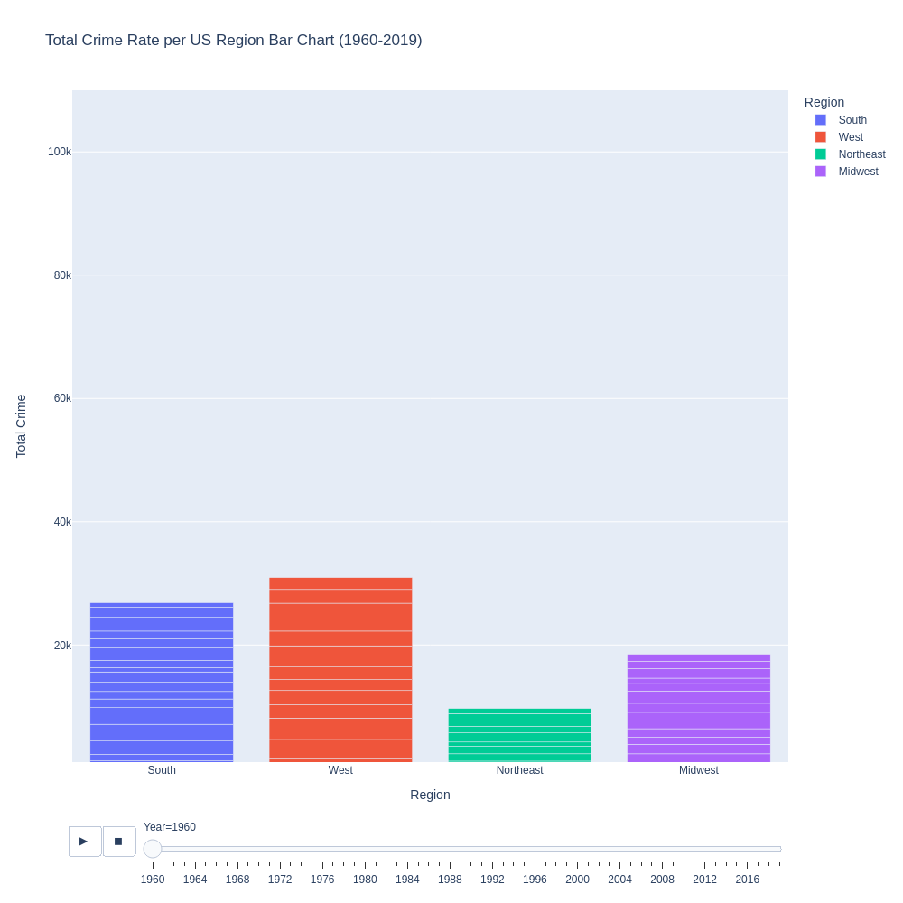

# US Florida Violent Crime Infographic
### Data Analysis and Visualization of Violent Crime in Florida 1960-2019

    
    <h3>Overview</h3>
    
This dynamic infographic allows users to review the tendencies on crime in the state of Florida.

    
The data uses the rate extracted from reported offenses per 100,000 people.

    
The following are the types of crime covered

    <ul>
        <li>
            <h4>Assault</h4>
            
Attempt to initiate harmful contact against another person or threatening to so so

        </li>
        <li>
            <h4>Burglary</h4>
            
The illegal and unauthorized entry to a property with criminal intention

        </li>
        <li>
            <h4>Larceny</h4>
            
Burglaries of Theft of any other personal property

        </li>
        <li>
            <h4>Motor</h4>
            
Crimen involving the theft of vechiles such as grand theft auto

        </li>
        <li>
            <h4>Murder</h4>
            
The unlawful killing of another human being without justification

        </li>
        <li>
            <h4>Rape</h4>
            
Carnal knowledge of a female forcibly and against her will

        </li>
        <li>            <h4>Robbery</h4>
            
Crimes of theft where violence, threat, force, and fear where used against the victim

        </li>
    </ul>

    <h3>Data Source</h3>
    
<a href="https://corgis-edu.github.io/corgis/csv/state_crime/" target="_blank">State Crime Data Source</a>

    
A website that serves as a second source from the Unified Crime Reporting Statistics produced out of the collaboration of the following organizations

    <ul>
        <li>U.S Department of Justice</li>
        <li>Federal Bureau of Investigation</li>
    </ul>

    <h3>Plot</h3>
    

    <h3>Conclusion</h3>
    
The decade of the 60's represented the lowest crime rates until today.

    
The highest crime rates are found around the 70's and the 80's

    
Even though crime rates have diminished ever since the 90's. They are still not as low as they were in the 60's.

